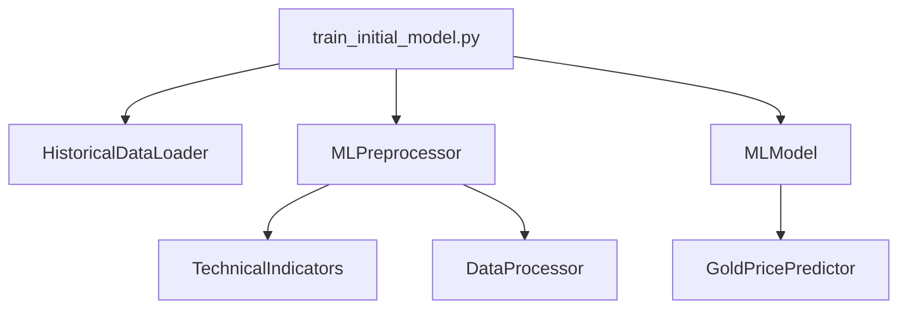

# TRADING BOT XAU/USD

## Description
Bot de trading automatique spécialisé dans l'analyse multi-timeframes de l'or (XAU/USD).
Utilise l'apprentissage automatique et l'analyse technique.

## Installation
1. Cloner le repository
2. Installer les dépendances : `pip install -r requirements.txt`
3. Configurer `.env` avec votre clé API Marketstack

## Structure
```
src/
    data_collection/   - Collecte des données
    preprocessing/     - Traitement des données
    features/         - Indicateurs techniques
    models/          - Modèles de prédiction
    visualization/    - Visualisation
tests/              - Tests unitaires
config/             - Configuration
requirements.txt    - Dépendances
```

## Commandes Principales

### 1. COLLECTE DE DONNÉES
- Historique (une timeframe):
  ```bash
  python src/data_collection/historical_data.py --timeframe 5m
  ```
   
- Toutes timeframes:
  ```bash
  python src/data_collection/historical_data.py --all-timeframes
  ```
   
- Temps réel:
  ```bash
  python src/data_collection/marketstack_api.py
  ```

### 2. TRAITEMENT DES DONNÉES
- Basique:
  ```bash
  python src/preprocessing/data_processor.py --input XAUUSD_5m.csv
  ```
   
- Avancé:
  ```bash
  python src/preprocessing/data_processor.py --input XAUUSD_5m.csv --max-gap-multiplier 20.0
  ```

### 3. ANALYSE TECHNIQUE
- Ajouter indicateurs:
  ```bash
  python src/features/technical_indicators.py --input XAUUSD_5m.csv
  ```
   
- Générer rapport:
  ```bash
  python src/features/technical_indicators.py --report
  ```

### 4. TESTS
- Tous les tests:
  ```bash
  pytest
  ```
   
- Tests spécifiques:
  ```bash
  pytest test_data_processor.py
  pytest test_historical.py
  ```

## Timeframes Disponibles
| Timeframe | Description |
|-----------|-------------|
| 5m        | 5 minutes   |
| 15m       | 15 minutes  |
| 30m       | 30 minutes  |
| 1h        | 1 heure     |
| 4h        | 4 heures    |
| 1d        | 1 jour      |
| 1w        | 1 semaine   |
| 1M        | 1 mois      |

## Indicateurs Techniques

### Moyennes Mobiles
- SMA (Simple Moving Average)
  - Périodes : 10, 20, 50, 200
- EMA (Exponential Moving Average)
  - Périodes : 12, 26

### Indicateurs de Momentum
- RSI (Relative Strength Index)
  - Période : 14
- MACD (Moving Average Convergence Divergence)
  - EMA rapide : 12
  - EMA lente : 26
  - Signal : 9
- Stochastique
  - %K période : 14
  - %D période : 3

### Indicateurs de Volatilité
- ATR (Average True Range)
  - Période : 14
- Bandes de Bollinger
  - Période : 20
  - Écart-type : 2

### Indicateurs de Volume
- Volume SMA (20 périodes)
- Ratio de Volume
- OBV (On-Balance Volume)

Tous les indicateurs sont calculés sur chaque timeframe et utilisés comme features pour l'entraînement du modèle.

## Configuration du Modèle de Trading

### Période couverte
- Données historiques de 2004 à 2024 (20 ans)
- Source : Dataset Kaggle "xauusd-gold-price-historical-data-2004-2024"

### Échantillons
- 3000 échantillons cibles pour l'entraînement
- Timeframes analysés :
  - 5 minutes (5m)
  - 15 minutes (15m)
  - 30 minutes (30m)
  - 1 heure (1h)
  - 4 heures (4h)
  - 1 jour (1d)
  - 1 semaine (1w)
  - 1 mois (1M)

### Configuration du Backtest
- Capital initial : 100,000 unités
- Seuils de confiance testés : 50%, 70%, et 90%
- Validation sur données historiques de 20 ans

### Paramètres de Trading
- Objectif par trade : 25 pips
- Horizon de prédiction : 12 périodes
- Seuil de confiance minimum : 70%

### Paramètres de Risque
- Stop loss : 2% du prix d'entrée
- Take profit : 3% du prix d'entrée
- Taille de position : 2% du capital par trade
- Ratio risque/récompense : 1:1.5

### Configuration des Trades
- Capital initial : 100,000 unités
- Gestion de risque conservatrice
- Stops et targets automatiques
- Validation multi-timeframe des signaux

### En termes monétaires (sur un capital de 100,000)
- Montant risqué par trade : 2,000 (2% du capital)
- Stop loss maximum : 2,000 (2% du capital)
- Gain potentiel : 3,000 (3% du capital)

## Processus d'Analyse pour la Prise de Position

### 1. Analyse Multi-Timeframe
- Analyse simultanée sur 8 timeframes :
  - Court terme : 5m, 15m, 30m
  - Moyen terme : 1h, 4h
  - Long terme : 1d, 1w, 1M
- Validation croisée des signaux entre timeframes

### 2. Analyse Technique
- **Tendance** :
  - SMA (10, 20, 50, 200)
  - EMA (12, 26)
  - Distance des prix par rapport aux moyennes mobiles
  
- **Momentum** :
  - RSI (14)
  - MACD (12, 26, 9)
  - Stochastique (14, 3)
  - ROC (Rate of Change)
  
- **Volatilité** :
  - ATR (14)
  - Bandes de Bollinger (20, 2)
  - Volatilité sur 5, 10, 20 périodes
  
- **Volume** :
  - Volume SMA (20)
  - Ratio de Volume
  - OBV (On-Balance Volume)

### 3. Validation du Signal
1. **Pré-validation** :
   - Vérification des conditions de marché
   - Analyse de la volatilité actuelle
   - Vérification du volume

2. **Analyse ML** :
   - Prédiction du modèle LSTM/Transformer
   - Score de confiance minimum : 70%
   - Validation sur plusieurs timeframes

3. **Filtres de Trading** :
   - Seuil de confiance : 0.7 (70%)
   - Direction du trade (-1 vente, 0 neutre, 1 achat)
   - Confirmation multi-timeframe

### 4. Gestion du Risque
- Position size : 2% du capital
- Stop loss : 2% du prix d'entrée
- Take profit : 3% du prix d'entrée
- Objectif minimum : 25 pips par trade
- Ratio risque/récompense : 1:1.5

### 5. Conditions d'Entrée
1. Score de confiance ≥ 70%
2. Confirmation sur au moins 3 timeframes
3. Volume suffisant
4. Volatilité dans la plage acceptable
5. Respect des niveaux de risk management

## Fonctionnalités
- ✨ Analyse multi-timeframes
- 🕒 Gestion des gaps temporels
- 🔍 Détection d'anomalies
- 📊 Indicateurs techniques
- 💹 Signaux de trading
- ⚖️ Équilibrage des données
- 🔌 API Marketstack
- ✅ Validation des données
- 🧪 Tests unitaires

## Dépendances
```
numpy >= 1.21.0
pandas >= 1.3.0
scikit-learn >= 0.24.2
tensorflow==2.13.0
ta >= 0.7.0
kaggle == 1.5.16
requests == 2.31.0
python-dotenv == 1.0.0
matplotlib >= 3.7.1
seaborn >= 0.12.2
```

## Notes
- 📅 Données historiques disponibles de 2004 à 2024
- 🏆 Optimisé pour l'or (XAU/USD)
- 📈 Minimum 500 échantillons requis par timeframe
- ⚡ Gestion intelligente des gaps temporels
- 🔄 Validation automatique des données

## Processus lorsque train_initial_model.py est lancé 
1. Initialisation
# Configuration initiale
- Création des dossiers 'models' et 'logs'
- Configuration du système de logging
- Initialisation des paramètres de base

2. Chargement des Données
# Via HistoricalDataLoader
1. Charge les données de tous les timeframes (5m, 15m, 30m, etc.)
2. Vérifie la qualité des données
3. Normalise les formats de dates et colonnes

3. Prétraitement (via MLPreprocessor)
  a. Normalisation des données
   - Prix OHLC
   - Volumes
   
  b. Création des features techniques
   - RSI, MACD, Moyennes mobiles
   - Indicateurs de volatilité
   - Features personnalisées
   
  c. Création des séquences
   - Découpage en séquences temporelles
   - Labellisation des données (-1, 0, 1)
   
  d. Split des données
   - Train/Validation/Test
   - Stratification pour équilibrer les classes
  
4. Optimisation des Hyperparamètres
# Via HyperparameterOptimizer
a. Définition des plages de paramètres à tester
   - Learning rate
   - Taille des batches
   - Unités LSTM
   - Dropout
   - Régularisation

b. Utilisation d'Optuna pour l'optimisation
   - Tests de différentes combinaisons
   - Validation croisée temporelle
   - Sélection des meilleurs paramètres

5. Construction et Entraînement du Modèle
a. Création du modèle avec les meilleurs paramètres
   - Architecture LSTM ou Transformer
   - Couches de régularisation
   
b. Entraînement
   - Early stopping
   - Réduction du learning rate sur plateau
   - Monitoring des performances par classe
   
c. Sauvegarde des checkpoints
   - Meilleur modèle
   - Logs d'entraînement

6. Évaluation et Backtest
a. Évaluation sur données de test
   - Métriques de classification
   - Analyse par timeframe
   
b. Backtest du modèle
   - Simulation de trading
   - Calcul des PnL
   - Analyse des performances

7. Sauvegarde des Résultats
a. Sauvegarde du modèle final
b. Export des métriques et statistiques
c. Génération des logs détaillés

## Fonction Principale de train_initial_model.py

Le script `train_initial_model.py` est le cœur du système d'entraînement du modèle de trading. Sa fonction principale est d'entraîner un modèle LSTM multi-timeframe optimisé pour la prédiction des mouvements de l'or (XAU/USD).

### Caractéristiques Clés

1. **Architecture Multi-Timeframe**
   - Analyse simultanée de 8 timeframes (5m à 1M)
   - Fusion des signaux pour une prédiction robuste
   - Validation croisée temporelle

2. **Optimisation Automatique**
   - Utilisation d'Optuna pour l'optimisation des hyperparamètres
   - Recherche sur plus de 20 combinaisons de paramètres
   - Validation avec walk-forward pour éviter le surapprentissage

3. **Gestion de la Mémoire**
   - Nettoyage automatique de la mémoire GPU/CPU
   - Checkpoints réguliers
   - Gestion dynamique des ressources

4. **Monitoring Avancé**
   - Suivi des performances par classe
   - Ajustement dynamique des poids des classes
   - Détection des biais de prédiction

5. **Backtest Intégré**
   - Simulation réaliste avec spreads et slippage
   - Calcul des coûts dynamiques basés sur l'ATR
   - Gestion sophistiquée du risque

### Processus d'Entraînement

1. **Préparation des Données**
   ```python
   data_dict = load_historical_data()
   sequences = preprocessor.create_sequences(data_dict)
   ```

2. **Optimisation des Hyperparamètres**
   ```python
   best_params = preprocessor.optimize_hyperparameters(
       train_data=sequences['train'],
       n_combinations=20
   )
   ```

3. **Entraînement du Modèle**
   ```python
   model = MLModel(input_shape, learning_rate)
   history = model.train_multi_timeframe(
       train_X,
       sequences['train']['y'],
       validation_data=(test_X, sequences['test']['y'])
   )
   ```

4. **Backtest et Évaluation**
   ```python
   backtest_results = backtest_model(
       model,
       sequences['test']['X'],
       sequences['test']['y'],
       data_dict['5m']
   )
   ```

### Paramètres Optimisés

- Learning rate: 1e-5 à 1e-2
- Batch size: 16, 32, 64
- Unités LSTM: 32-256 (première couche), 16-128 (seconde couche)
- Dropout: 0.1-0.5
- Régularisation L1/L2: 1e-6 à 1e-3
- Patience pour early stopping: 10-50

### Métriques de Performance

- Accuracy balancée par classe
- Ratio de Sharpe
- Maximum drawdown
- Profit factor
- Win rate
- Rendement moyen par trade

## Classe MLModel

La classe `MLModel` est le composant central du système de trading, implémentant un modèle d'apprentissage profond multi-timeframe avec des architectures LSTM et Transformer.

### Caractéristiques Principales

1. **Architectures Flexibles**
   - Support LSTM et Transformer
   - Sélection automatique de l'architecture optimale
   - Configuration adaptative par timeframe

2. **Gestion Multi-Timeframe**
   ```python
   timeframe_config = {
       'input_5m': {'weight': 0.25, 'volatility_factor': 1.0},
       'input_15m': {'weight': 0.20, 'volatility_factor': 1.2},
       'input_1h': {'weight': 0.15, 'volatility_factor': 1.8},
       'input_1d': {'weight': 0.07, 'volatility_factor': 2.5}
   }
   ```

3. **Prédiction avec Confiance**
   ```python
   predictions = model.predict_with_confidence(
       X_dict,
       confidence_threshold=0.7
   )
   ```

4. **Optimisation Mémoire**
   - Mode économe en mémoire pour grands datasets
   - Nettoyage automatique des ressources
   - Gestion des batchs optimisée

### Architectures Supportées

1. **LSTM Multi-Timeframe**
   - Couches LSTM empilées (32-256 unités)
   - Dropout adaptatif (0.1-0.5)
   - Connexions résiduelles

2. **Transformer**
   - Attention multi-tête
   - Encodage positionnel
   - Feed-forward networks avec gating

### Fonctionnalités Trading

1. **Calcul des Coûts**
   ```python
   costs = model._calculate_transaction_costs(
       price=1800.0,
       volatility=0.002
   )
   ```

2. **Gestion des Positions**
   - Calcul dynamique de la taille
   - Ajustement selon la volatilité
   - Gestion des stops et targets

3. **Backtest Intégré**
   ```python
   results = model.backtest_model(
       X_test_dict,
       y_test,
       confidence_threshold=0.7,
       initial_balance=100000
   )
   ```

### Métriques et Monitoring

1. **Trading Metrics**
   - Win rate et profit factor
   - Ratio Sharpe et drawdown
   - Analyse des coûts de transaction

2. **Performance Monitoring**
   - Suivi par timeframe
   - Détection des biais
   - Ajustement des poids

### Gestion des Données

1. **Normalisation**
   - Standardisation par instrument
   - Gestion des prix hors plage
   - Ajustement dynamique des scalers

2. **Validation**
   - Vérification des timeframes manquants
   - Interpolation intelligente
   - Gestion des données incomplètes

### Exemple d'Utilisation

```python
# Initialisation
model = MLModel(
    input_shape=(60, 10),
    n_classes=3,
    model_type='auto',
    memory_efficient=True
)

# Entraînement
history = model.train_multi_timeframe(
    X_train,
    y_train,
    validation_data=(X_val, y_val),
    epochs=50
)

# Prédiction
predictions = model.predict_with_confidence(
    X_test,
    confidence_threshold=0.7
)

# Backtest
results = model.backtest_model(
    X_test,
    initial_capital=100000
)
```

### Configuration Avancée

1. **Transformer**
   ```python
   transformer_config = {
       'head_size': 256,
       'num_heads': 4,
       'ff_dim_factor': 4,
       'num_blocks': 4
   }
   ```

2. **Optimisation Mémoire**
   ```python
   memory_config = {
       'gru': {
           'units': [64, 32],
           'dropout': 0.3
       }
   }
   ```

3. **Timeframes**
   ```python
   timeframe_keys = {
       '5m': 'input_5m',
       '1h': 'input_1h',
       '1d': 'input_1d'
   }
   ```

Cette classe forme le cœur du système de trading, combinant apprentissage profond avancé et gestion sophistiquée du trading en temps réel.

## Classe TechnicalIndicators

La classe `TechnicalIndicators` est responsable du calcul et de la gestion des indicateurs techniques pour l'analyse des prix. Elle offre une approche modulaire et configurable pour l'analyse technique.

### Configuration des Indicateurs

1. **Indicateurs de Tendance**
   ```python
   trend_config = {
       'sma': {
           'periods': [20, 50, 200],
           'apply_to': 'Close'
       },
       'ema': {
           'periods': [12, 26],
           'alpha': None
       },
       'macd': {
           'fast': 12,
           'slow': 26,
           'signal': 9
       },
       'adx': {
           'periods': [14],
           'method': 'wilder'
       }
   }
   ```

2. **Indicateurs de Momentum**
   ```python
   momentum_config = {
       'rsi': {
           'periods': [14],
           'method': 'wilder'
       },
       'stoch': {
           'k_period': 14,
           'd_period': 3,
           'smooth_k': 3
       },
       'williams_r': {
           'period': 14
       }
   }
   ```

3. **Indicateurs de Volatilité**
   ```python
   volatility_config = {
       'bbands': {
           'period': 20,
           'std_dev': 2,
           'bands': ['upper', 'middle', 'lower']
       },
       'atr': {
           'periods': [14],
           'normalize': True
       }
   }
   ```

### Fonctionnalités Principales

1. **Calcul Optimisé**
   - Traitement vectorisé des données
   - Gestion intelligente de la mémoire
   - Parallélisation des calculs lourds

2. **Gestion des Données Manquantes**
   ```python
   # Analyse des séquences de NaN
   nan_sequences = indicator._get_nan_sequences(data)
   
   # Interpolation avancée
   clean_data = indicator._advanced_interpolation(data)
   ```

3. **Validation et Nettoyage**
   - Détection des anomalies
   - Interpolation intelligente
   - Gestion des valeurs aberrantes

### Utilisation

1. **Initialisation Basique**
   ```python
   indicators = TechnicalIndicators()
   df_with_indicators = indicators.calculate_all(price_data)
   ```

2. **Configuration Personnalisée**
   ```python
   custom_config = {
       'trend': {
           'sma': {'periods': [10, 30, 100]},
           'macd': {'fast': 8, 'slow': 21}
       }
   }
   indicators = TechnicalIndicators(custom_config)
   ```

3. **Ajout d'Indicateurs Personnalisés**
   ```python
   def custom_indicator(data, params):
       # Logique personnalisée
       return result
   
   indicators.add_custom_indicator(
       name='custom_ind',
       function=custom_indicator,
       default_params={'period': 14}
   )
   ```

### Gestion des Erreurs

1. **Validation des Données**
   - Vérification des formats
   - Contrôle des plages de valeurs
   - Détection des discontinuités

2. **Nettoyage par Catégorie**
   - Approche spécifique par type d'indicateur
   - Méthodes d'interpolation adaptées
   - Gestion des cas limites

3. **Logging Avancé**
   ```python
   indicators._log_indicator_stats(df)
   # Affiche des statistiques détaillées par indicateur
   ```

### Optimisations

1. **Traitement des Séquences**
   - Détection intelligente des gaps
   - Interpolation contextuelle
   - Préservation des tendances

2. **Performance**
   - Mise en cache des calculs intermédiaires
   - Optimisation des allocations mémoire
   - Parallélisation quand possible

3. **Qualité des Données**
   - Validation multi-niveau
   - Correction automatique des anomalies
   - Maintien de la cohérence temporelle

### Exemple Complet

```python
# Configuration personnalisée
config = {
    'trend': {
        'sma': {'periods': [20, 50, 200]},
        'ema': {'periods': [12, 26]}
    },
    'momentum': {
        'rsi': {'periods': [14]},
        'stoch': {'k_period': 14}
    },
    'volatility': {
        'bbands': {'period': 20},
        'atr': {'periods': [14]}
    }
}

# Initialisation
indicators = TechnicalIndicators(config)

# Calcul des indicateurs
df_processed = indicators.calculate_all(
    df=price_data,
    instrument='XAUUSD'
)

# Validation et nettoyage
df_clean = indicators._validate_and_clean(df_processed)

# Log des statistiques
indicators._log_indicator_stats(df_clean)
```

Cette classe fournit une base solide pour l'analyse technique, avec une emphase sur la qualité des données et la performance des calculs.

## Classe MLPreprocessor

La classe `MLPreprocessor` est responsable du prétraitement des données pour le modèle de machine learning. Elle gère la normalisation, le calcul des features et la préparation des séquences d'entraînement.

### Caractéristiques Principales

1. **Normalisation Spécialisée**
   ```python
   class MLPreprocessor:
       def __init__(self, instrument='XAUUSD'):
           self.feature_scaler = MinMaxScaler()  # Features techniques
           self.price_scaler = MinMaxScaler()    # Prix OHLC
           self.expected_price_ranges = {
               'XAUUSD': {
                   'min': 1000,
                   'max': 3000,
                   'unit': 'USD/oz'
               }
           }
   ```

2. **Gestion Multi-Timeframe**
   - Traitement parallèle des timeframes
   - Synchronisation des données
   - Validation croisée des features

3. **Calcul des Features**
   - Indicateurs techniques via TechnicalIndicators
   - Features dérivées des prix
   - Normalisation adaptative

### Préparation des Données

1. **Prétraitement Multi-Timeframe**
   ```python
   processed_data = preprocessor.prepare_multi_timeframe_features(
       data_dict={
           '5m': df_5m,
           '1h': df_1h,
           '1d': df_1d
       }
   )
   ```

2. **Création des Séquences**
   ```python
   X_train, y_train, X_test, y_test = preprocessor.prepare_data_for_training(
       data_dict=processed_data,
       sequence_length=15,
       prediction_horizon=12,
       train_size=0.8
   )
   ```

3. **Validation des Données**
   - Vérification des distributions
   - Détection des anomalies
   - Gestion des valeurs manquantes

### Features Techniques

1. **Indicateurs de Base**
   ```python
   def _add_basic_indicators(self, df):
       # SMA
       df['SMA_20'] = df['Close'].rolling(window=20).mean()
       
       # RSI
       df['RSI'] = self._calculate_rsi(df['Close'])
       
       # Volatilité
       df['Volatility'] = df['Close'].pct_change().rolling(20).std()
       
       return df
   ```

2. **Features Avancées**
   - ATR et Bandes de Bollinger
   - Returns et volatilité
   - Features personnalisées

3. **Normalisation Adaptative**
   - Standardisation par instrument
   - Gestion des outliers
   - Mise à l'échelle dynamique

### Préparation Live

1. **Features Temps Réel**
   ```python
   live_features = preprocessor._prepare_live_features(
       new_data=latest_data,
       timeframe='5m'
   )
   ```

2. **Mise à Jour Continue**
   - Actualisation des scalers
   - Gestion de la mémoire
   - Validation en temps réel

### Logging et Monitoring

1. **Statistiques Détaillées**
   ```python
   preprocessor._print_distribution(y_train)
   # Affiche:
   # Distribution des classes:
   # Classe -1:  985 échantillons (32.83%)
   # Classe  0: 1024 échantillons (34.13%)
   # Classe  1:  991 échantillons (33.03%)
   ```

2. **Validation des Features**
   - Contrôle des distributions
   - Détection des biais
   - Suivi des transformations

### Exemple d'Utilisation Complet

```python
# Initialisation
preprocessor = MLPreprocessor(instrument='XAUUSD')

# Chargement et prétraitement des données
data_dict = load_historical_data()
processed_data = preprocessor.prepare_multi_timeframe_features(data_dict)

# Vérification des features
for timeframe, data in processed_data.items():
    print(f"\nTimeframe: {timeframe}")
    print(f"Shape: {data.shape}")
    print("\nFeatures calculées:")
    print(data.columns.tolist())

# Préparation pour l'entraînement
X_train, y_train, X_test, y_test = preprocessor.prepare_data_for_training(
    data_dict=processed_data,
    sequence_length=15,
    prediction_horizon=12
)

# Validation des distributions
preprocessor._print_distribution(y_train)
preprocessor._print_distribution(y_test)
```

### Configuration Avancée

1. **Paramètres de Prétraitement**
   ```python
   config = {
       'sequence_length': 15,
       'prediction_horizon': 12,
       'train_size': 0.8,
       'target_samples': 3000
   }
   ```

2. **Gestion des Timeframes**
   ```python
   timeframe_weights = {
       '5m': 0.25,
       '15m': 0.20,
       '1h': 0.15,
       '4h': 0.10
   }
   ```

3. **Validation des Données**
   ```python
   validation_params = {
       'min_samples': 500,
       'max_gap': 20,
       'distribution_threshold': 0.1
   }
   ```

Cette classe est essentielle pour la préparation des données d'entraînement et assure la qualité et la cohérence des features utilisées par le modèle.

## Classe DataProcessor

La classe `DataProcessor` est responsable du traitement et du nettoyage des données financières brutes. Elle hérite de `BaseDataProcessor` et implémente une logique spécialisée pour différents types d'instruments.

### Architecture

1. **Hiérarchie des Classes**
   ```python
   class BaseDataProcessor(ABC):
       """Classe de base abstraite pour le traitement des données"""
       
   class DataProcessor(BaseDataProcessor):
       """Processeur générique pour les données financières"""
       
       def __init__(self, instrument_type='forex', is_base=False):
           self.instrument_type = instrument_type
           self.processor = None if is_base else self._get_specialized_processor()
   ```

2. **Configuration par Timeframe**
   ```python
   gap_thresholds = {
       '5m':  {'max_gap_ratio': 0.05, 'critical_ratio': 1.5},
       '15m': {'max_gap_ratio': 0.07, 'critical_ratio': 2.0},
       '1h':  {'max_gap_ratio': 0.10, 'critical_ratio': 3.0},
       '1d':  {'max_gap_ratio': 0.15, 'critical_ratio': 5.0}
   }
   ```

### Fonctionnalités Principales

1. **Traitement des Données Manquantes**
   ```python
   def _handle_missing_data(self, df, timeframe):
       # Traitement des prix OHLC
       if any(df[price_cols].isna().any()):
           df = self._handle_price_gaps(df, timeframe)
           
       # Traitement du volume
       if df['Volume'].isna().any():
           df = self._handle_volume_gaps(df, timeframe)
           
       return df
   ```

2. **Traitement par Chunks**
   ```python
   chunk_config = {
       '5m':  {'size': 50000, 'overlap': 1000},
       '15m': {'size': 25000, 'overlap': 500},
       '1h':  {'size': 10000, 'overlap': 200}
   }
   ```

3. **Validation des Données**
   - Vérification de la continuité temporelle
   - Détection des anomalies de prix
   - Validation des volumes

### Gestion des Gaps

1. **Détection des Gaps**
   ```python
   def detect_gaps(self, df, timeframe):
       # Identifier les gaps de prix
       price_gaps = df[price_cols].isna().all(axis=1)
       isolated_gaps = ~price_gaps.shift(1) & price_gaps & ~price_gaps.shift(-1)
       long_gaps = price_gaps & ~isolated_gaps
   ```

2. **Interpolation Adaptative**
   - Interpolation linéaire pour gaps courts
   - Interpolation cubique pour gaps moyens
   - Méthodes avancées pour longs gaps

3. **Fusion des Chunks**
   ```python
   def _merge_overlap(self, prev_chunk, curr_chunk, overlap):
       # Fusion progressive des valeurs
       weights = np.linspace(0, 1, overlap)
       overlap_mask = get_overlap_mask(curr_chunk, overlap)
       
       for col in numeric_cols:
           curr_chunk.loc[overlap_mask, col] = weighted_merge(
               prev_vals=prev_chunk.loc[overlap_mask, col],
               curr_vals=curr_chunk.loc[overlap_mask, col],
               weights=weights
           )
   ```

### Indicateurs Techniques

1. **Configuration de Base**
   ```python
   technical_indicators_config = {
       'trend': {
           'EMA': {'periods': [12, 26, 50]},
           'MACD': {'fast': 12, 'slow': 26, 'signal': 9}
       }
   }
   ```

2. **Ajout d'Indicateurs**
   ```python
   def add_technical_indicators(self, df):
       try:
           self.logger.info("\nAjout des indicateurs techniques...")
           return self.indicator_calculator.calculate_all(df)
       except Exception as e:
           return self._add_basic_indicators(df)
   ```

### Logging et Monitoring

1. **Configuration du Logging**
   ```python
   def _setup_logging(self):
       logger = logging.getLogger(self.__class__.__name__)
       fh = logging.FileHandler(
           f'logs/preprocessing/processor_{datetime.now():%Y%m%d_%H%M%S}.log',
           encoding='utf-8'
       )
   ```

2. **Suivi des Opérations**
   - Logging détaillé des transformations
   - Statistiques de nettoyage
   - Alertes sur anomalies

### Exemple d'Utilisation

```python
# Initialisation
processor = DataProcessor(instrument_type='forex')

# Chargement et traitement des données
df = load_raw_data('XAUUSD_5m.csv')
df_processed = processor.process_data(
    df,
    timeframe='5m',
    handle_gaps=True,
    add_indicators=True
)

# Vérification des résultats
processor.validate_processed_data(df_processed)
```

### Configuration Avancée

1. **Paramètres de Traitement**
   ```python
   processing_params = {
       'gap_filling': {
           'max_gap_length': 5,
           'interpolation_method': 'cubic'
       },
       'chunking': {
           'enable': True,
           'chunk_size': 50000
       },
       'validation': {
           'price_threshold': 3.0,
           'volume_threshold': 5.0
       }
   }
   ```

2. **Gestion des Erreurs**
   ```python
   try:
       df_processed = processor.process_data(df)
   except DataQualityError as e:
       logger.error(f"Erreur de qualité des données: {e}")
       df_processed = processor.apply_fallback_processing(df)
   ```

Cette classe forme la base du pipeline de prétraitement des données, assurant leur qualité et leur cohérence avant l'utilisation par les modèles de ML.

## Classe GoldPricePredictor

La classe `GoldPricePredictor` implémente un modèle de deep learning spécialisé pour la prédiction des prix de l'or, utilisant une architecture multi-timeframe avec attention.

### Architecture du Modèle

1. **Structure Multi-Timeframe**
   ```python
   def __init__(self, sequence_length=10, n_features=29):
       # Entrées pour chaque timeframe
       input_1d = Input(shape=(sequence_length, n_features))
       input_4h = Input(shape=(sequence_length * 6, n_features))
       input_1h = Input(shape=(sequence_length * 24, n_features))
   ```

2. **Branches de Traitement**
   ```python
   def create_timeframe_branch(inputs, name):
       # Convolutions 1D
       x = Conv1D(32, kernel_size=2, activation='relu')(inputs)
       x = Conv1D(32, kernel_size=4, activation='relu')(x)
       
       # BiLSTM avec attention
       lstm = Bidirectional(LSTM(32, return_sequences=True))(x)
       attention = Attention()([lstm, lstm])
       
       return attention
   ```

### Caractéristiques Principales

1. **Architecture Avancée**
   - Convolutions 1D pour l'extraction de features
   - BiLSTM avec mécanisme d'attention
   - Connexions résiduelles
   - Normalisation des couches

2. **Loss Function Adaptative**
   ```python
   def multi_timeframe_loss(y_true, y_pred):
       # MSE de base
       mse = tf.square(y_pred - y_true)
       
       # Variations à différentes échelles
       variations = [
           calculate_variation(y_true, 1),   # Daily
           calculate_variation(y_true, 6),   # 4h
           calculate_variation(y_true, 24)   # 1h
       ]
       
       # Poids adaptatifs
       weights = [tf.where(tf.abs(var) > 0.01, 1.5, 1.0)
                 for var in variations]
   ```

3. **Learning Rate Scheduling**
   ```python
   def create_lr_scheduler(self, epochs):
       initial_learning_rate = 0.0003
       decay_steps = epochs * 0.5
       decay_rate = 0.2
       
       def lr_scheduler(epoch):
           if epoch < decay_steps:
               return initial_learning_rate
           else:
               return initial_learning_rate * (
                   decay_rate ** ((epoch - decay_steps) / 10)
               )
   ```

### Entraînement et Évaluation

1. **Configuration de l'Entraînement**
   ```python
   model.train(
       X_train,
       y_train,
       epochs=150,
       batch_size=32,
       validation_split=0.2,
       callbacks=[
           early_stopping,
           lr_scheduler,
           checkpoint
       ]
   )
   ```

2. **Callbacks Avancés**
   - Early stopping avec restauration des meilleurs poids
   - Learning rate adaptatif
   - Checkpointing des modèles

3. **Visualisation des Performances**
   ```python
   def plot_training_history(self, history):
       plt.figure(figsize=(12, 4))
       
       # Loss plot
       plt.subplot(1, 2, 1)
       plt.plot(history.history['loss'])
       plt.plot(history.history['val_loss'])
       
       # MAE plot
       plt.subplot(1, 2, 2)
       plt.plot(history.history['mae'])
       plt.plot(history.history['val_mae'])
   ```

### Prédiction et Inférence

1. **Format Multi-Timeframe**
   ```python
   def predict(self, X_test):
       X_test_dict = {
           'daily_input': X_test,
           '4h_input': np.repeat(X_test, 6, axis=1),
           '1h_input': np.repeat(X_test, 24, axis=1)
       }
       return self.model.predict(X_test_dict)
   ```

2. **Métriques d'Évaluation**
   ```python
   def evaluate(self, y_true, y_pred):
       return {
           'MSE': mean_squared_error(y_true, y_pred),
           'RMSE': np.sqrt(mean_squared_error(y_true, y_pred)),
           'MAE': mean_absolute_error(y_true, y_pred)
       }
   ```

### Exemple d'Utilisation

```python
# Initialisation
predictor = GoldPricePredictor(
    sequence_length=10,
    n_features=29
)

# Entraînement
history = predictor.train(
    X_train,
    y_train,
    epochs=150,
    batch_size=32
)

# Prédiction
predictions = predictor.predict(X_test)

# Évaluation
metrics = predictor.evaluate(y_test, predictions)
print(f"RMSE: {metrics['RMSE']:.4f}")
print(f"MAE: {metrics['MAE']:.4f}")
```

### Configuration Avancée

1. **Paramètres du Modèle**
   ```python
   model_config = {
       'conv_filters': [32, 32],
       'lstm_units': [32, 64],
       'dense_units': [32, 16],
       'dropout_rate': 0.15,
       'learning_rate': 0.001
   }
   ```

2. **Paramètres d'Entraînement**
   ```python
   training_config = {
       'batch_size': 32,
       'epochs': 150,
       'validation_split': 0.2,
       'early_stopping_patience': 15
   }
   ```

Cette classe constitue le cœur du système de prédiction, combinant une architecture sophistiquée avec des mécanismes d'attention pour capturer les dépendances temporelles à différentes échelles.

## Flux d'Exécution de train_initial_model.py

### Vue d'Ensemble


### Séquence d'Exécution

1. **Initialisation (train_initial_model.py)**
   - Configure le logging et les dossiers
   - Initialise les paramètres d'entraînement

2. **Collecte des Données**
   ```python
   # Via historical_data.py
   loader = HistoricalDataLoader()
   data = loader.load_all_timeframes()  # Charge 5m -> 1M
   ```

3. **Prétraitement**
   ```python
   # Cascade de traitement
   preprocessor = MLPreprocessor()
   data_processor = DataProcessor()  # Nettoyage basique
   technical_indicators = TechnicalIndicators()  # Calcul des indicateurs
   
   processed_data = preprocessor.prepare_data(data)
   ```

4. **Construction du Modèle**
   ```python
   # Utilise price_predictor.py et ml_model.py
   model = MLModel()
   predictor = GoldPricePredictor()
   ```

### Interactions Clés

- **MLPreprocessor** orchestre le prétraitement en utilisant:
  - DataProcessor pour le nettoyage
  - TechnicalIndicators pour les features
  - Gestion des séquences multi-timeframes

- **MLModel** coordonne la prédiction via:
  - GoldPricePredictor pour l'architecture neuronale
  - Gestion des backtests et métriques

### Fichiers Impliqués

- `train_initial_model.py` : Script principal
- `historical_data.py` : Collecte des données
- `ml_preprocessor.py` : Coordination du prétraitement
- `technical_indicators.py` : Calcul des indicateurs
- `data_processor.py` : Nettoyage des données
- `ml_model.py` : Gestion du modèle
- `price_predictor.py` : Architecture neuronale

Cette orchestration assure un pipeline fluide du chargement des données jusqu'à l'entraînement du modèle.

